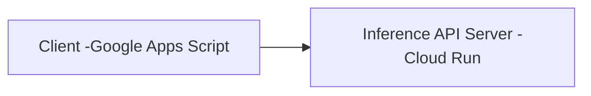
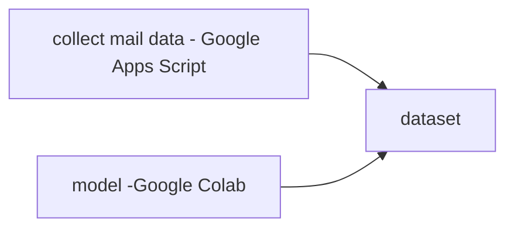

## Getting Started
Install from Google Marketplace, and then automatically label your emails. (per 1 hour)

## Architecure

```mermaid
graph LR
    A[Client -Google Apps Script] --> B[Inference API Server -Cloud Run]
```

## Development Environment

```mermaid
graph LR
    A[collect mail data - Google Apps Script] --> B[dataset]
    D[model -Google Colab] --> B
```
